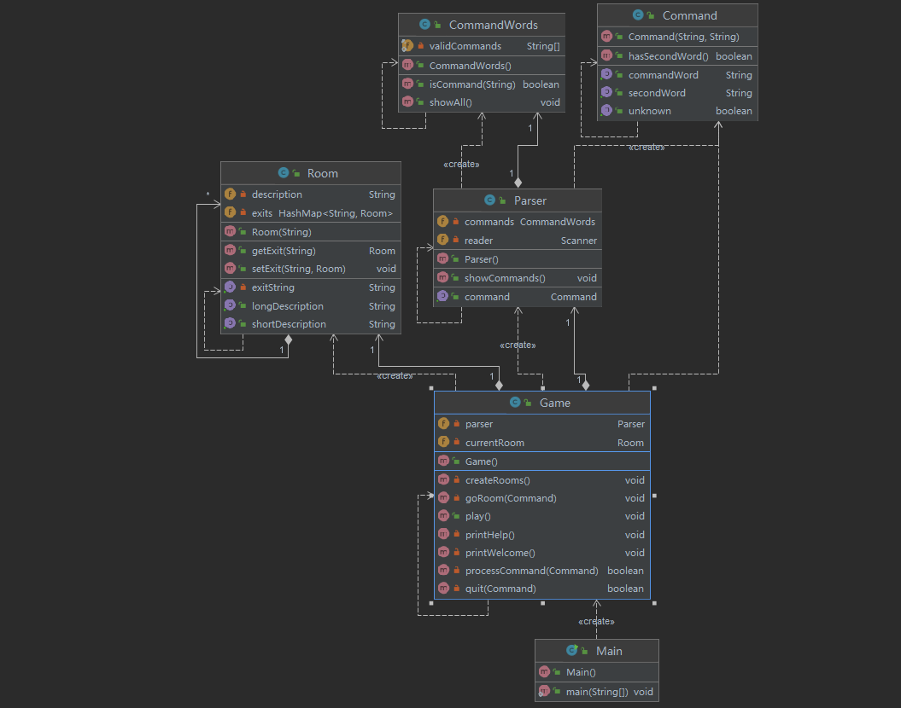

#实训任务一

###这次实训我学习到了如何规范代码和对代码进行注释，我还学习到了样例工程代码的一些逻辑。
###在Game类的processCommand()方法中，当用户输入的命令被辨认出来以后，有一系列的if语句用来分派程序到不同的地方去执行。从面向对象的设计原则来看，这种解决方案不太好，因为每当要加入一个新的命令时，就得在这一堆if语句中再加入一个if分支，最终会导致这个方法的代码膨胀得极其臃肿。在Game类的processCommand()方法中，当用户输入的命令被辨认出来以后，有一系列的if语句用来分派程序到不同的地方去执行。从面向对象的设计原则来看，这种解决方案不太好，因为每当要加入一个新的命令时，就得在这一堆if语句中再加入一个if分支，最终会导致这个方法的代码膨胀得极其臃肿。之后每增加一种职业，只要实现Profession接口就好，并在ProfessionFactory中注册自己。使用策略模式+工厂模式，再也不需要为日益增长的if else头疼了。